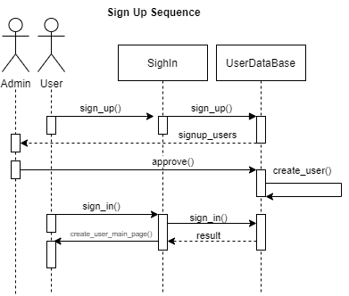
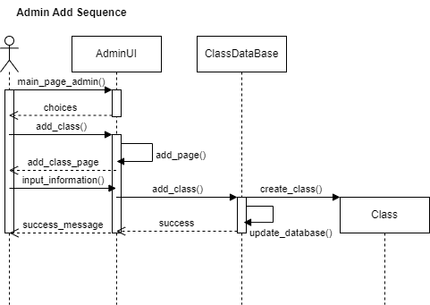
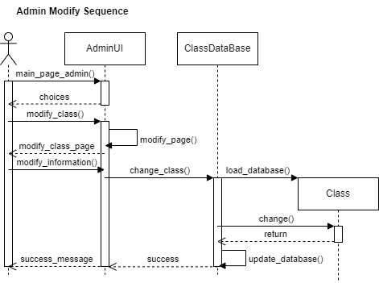
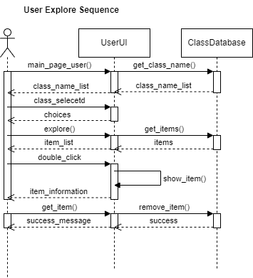
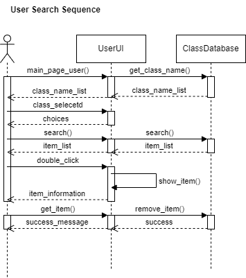
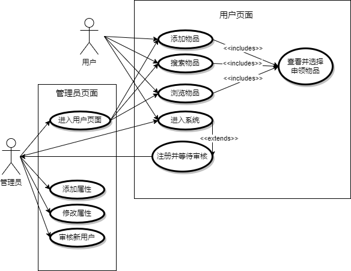
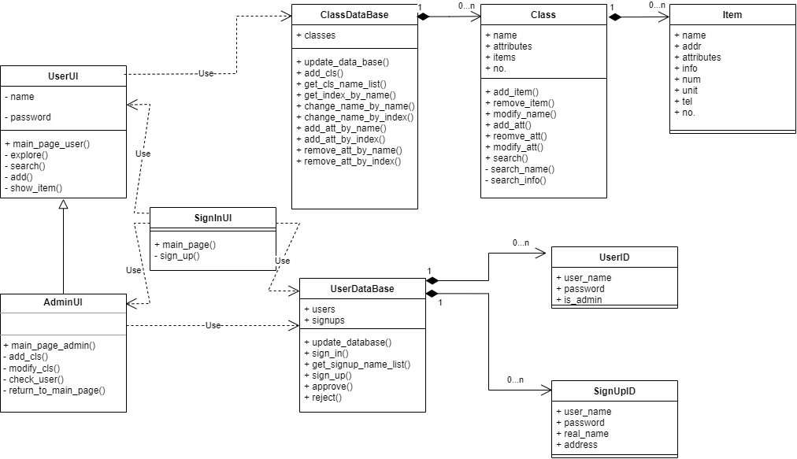

# 你帮我助系统

**现已更新2.0版本**

## 这是什么

~~这是一个课程作业，非相关人员不建议查看。同时，这也是一个时代的见证，见证了那个全中国人万众一心共同抗疫的时代。~~

这是一个物品互助系统。

疫情封控期间，想必大家都有和邻里交换物品的经历，为了方便大家互帮互助，这个程序可以统计各位业主捐赠的物品信息，也可以帮助业主申领爱心物品。

## 如何使用

### 环境

Python >= 2, numpy >= 1.18

### 运行

```
python main.py
```

### 使用

#### 登录与注册

直接输入已注册好的用户名和密码即可登录，如果没有注册，请点击注册按钮，填入正确的个人信息并联系社区管理员进行审核，登录与注册的设计流程如下图所示


#### 管理员

以admin用户名登录则自动进入*管理员页面*，管理员页面中有如下按钮
- 添加类型
- 修改类型
- 审核注册用户
- 进入用户页面

其中，管理员可以在“添加类型”中，向数据库中添加新的物品类型，只需要确定新类型的特殊属性个数，分别输入新类型的名称和属性名称，点击确定即可。添加类型的设计流程如下图所示



在“修改类型”中，管理员可以修改数据库中已有的物品类型，只需要选中要求改的物品类型，即可修改其名称，增删改其属性。修改类型的顺序图如下图所示



在“审核注册用户”中，管理员可以审核刚刚注册的新用户，请仔细审查业主真实姓名与住址，确定其为本小区的真实业主，并联系业主确认后通过，否则应该予以拒绝。

管理员可以从*管理员页面*打开*用户页面*，只需点击“打开用户页面”即可，用户页面在下面介绍。

#### 普通用户

以普通用户的用户名登录后则自动进入*用户页面*，用户页面中可以添加、搜索、浏览、申领物品，但在此之前，请选择想要操作的物品类型。

选择过后，点击“浏览物品”按钮，可以查看当前类型中的所有物品，双击喜欢的物品则可查看物品所有信息，在该信息页面中有申领物品按钮，点击后即可前往物品所在地领取这件物品。浏览物品设计流程如下图所示



点击“搜索物品”按钮，则可搜索想要的物品，搜索后会看到与“浏览物品”页面相似的页面，其中的物品均为搜索匹配项（或为名称匹配，或为详细信息匹配），双击喜欢的物品则可查看物品所有信息并可以申领该物品。搜索物品设计流程如下图所示



点击“添加物品”按钮，输入所要添加物品的名称、所在地址、自己的联系方式、物品数量与单位、物品描述与物品属性，即可成功添加物品。添加物品设计流程如下图所示


## 面向对象设计

类图和用例图如下






## 版本说明

上述介绍均为“你帮我住系统”ver2.0版，ver1.0版为其快速原型已弃用。